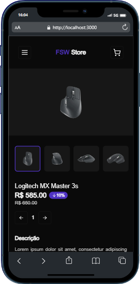
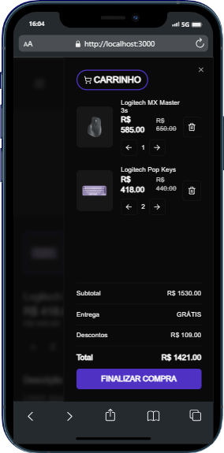

# E-commerce
Compre produtos eletrônicos online e rápido 

É possível se autenticar utilizando o Google (NextAuth) e navegar por diversas categorias como mouses, teclados e monitores. Adicione vários itens ao carrinho, vinculado a sua conta (feat. futura) e realize a sua compra online (Stripe). Projeto desenvolvido durante o evento Full Stack Week do Felipe Rocha.

Apenas o layout mobile está desenvolvido!
Layout desktop será desenvolvido em breve! Sinta-se à vontade para contribuir de qualquer maneira ao projeto.

Todos os produtos e detalhes como preços, descontos e link das imagens são armazenadas em um banco de dados postgresql (Prisma).




## ✨ Tecnologias
- Next.js | TypeScript | TailwindCSS | Shadcn-ui | lucid-react | Prisma | Stripe

## 🔖 Layout
Você pode visualizar o layout do projeto através [desse link](https://www.figma.com/file/1gbVNaWC6U8MnEy0jhPbg8/FSW-Store-%5BLive%5D-(Copy)?type=design&node-id=89%3A280&mode=design&t=yVqM5sAnpUxxP9E5-1).

## 💻 Uso
Crie sua aplicação através do Github. Configure o seu banco de dados postgresql, adicione a url de conexão nas variáveis ambiente e execute a seed do banco. Preencha todas as variáveis ambientes em um arquivo chamado *.env*, siga a nomenclatura usada no arquivo de exemplo *.env.example*.

Depois, em seu terminal:
```bash
# Clone o repositório
git clone https://github.com/ViGF/e-commerce.git
# Acesse a pasta do projeto
cd e-commerce
# Instale as dependências
npm i
# Execute a aplicação
npm dev
# Agora basta acessa-la
```